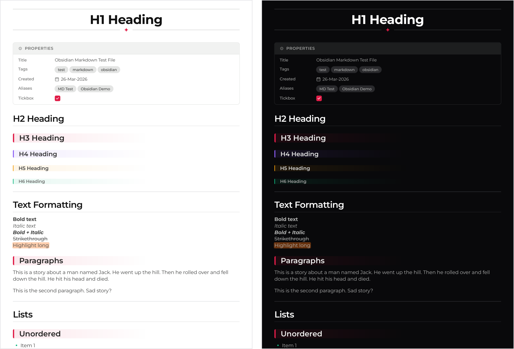

<p align="center">
  
</p>

<p align="center">
  <br>
  
  <br><br>
</p>

<p align="center">
  <a href="LICENSE"></a>
  <a href="https://www.rust-lang.org"></a>
</p>

## Overview

md2pdf turns an Obsidian note into a PDF that still looks like the note. Callouts stay callouts. Code stays highlighted. The frontmatter becomes the properties table you are used to seeing under the title.

It is one binary with the fonts already inside it. Nothing to install alongside it, nothing fetched over the network, and the same note comes out the same on any machine.

## Features

* **Callouts:** all 27 kinds Obsidian knows, each with its own colour and icon.
* **Properties:** frontmatter becomes the table under the title, with tag pills, formatted dates, links and checkboxes.
* **Footnotes:** numbered in the order you reference them, gathered under a divider at the end, each with a link back to where it was cited.
* **Code:** fenced blocks are syntax highlighted and labelled with their language.
* **Math:** LaTeX, both inline and as its own centred block.
* **Everything else:** image embeds, `==highlights==`, `%%comments%%`, `#tags`, task lists, tables, nested lists, strikethrough, and quotes.
* **Two themes:** light and dark.

## Install

You need Rust. Nothing else.

```bash
git clone https://github.com/ecstras-lab/md2pdf.git
cd md2pdf
cargo install --path .
```

## Usage

```bash
md2pdf note.md                       # writes PDF/note.pdf
md2pdf note.md -t dark               # dark theme
md2pdf notes/post.md -o ~/post.pdf   # choose where it lands
md2pdf note -q                       # add the .md, and say nothing
```

```
  -t, --theme <light|dark>       colour theme, light by default
  -o, --output <PATH>            write the PDF here
  -q, --quiet                    report nothing but errors
      --color <auto|always|never>
```

A missing `.md` is added for you. Without an output path the PDF mirrors your folders under `PDF/`, so `notes/2024/post.md` lands at `PDF/notes/2024/post.pdf`.

Every run says what it did.

```
  theme dark
 source notes/post.md
 output PDF/notes/post.pdf (155 KB in 1.4s)
```

Colour turns itself on when a terminal is reading and off when anything else is. `NO_COLOR`, `CLICOLOR_FORCE` and `--color` each get a say.

## What it will not do

A PDF has no web browser in it, and no video player, so a few things in a note have nowhere to go. None of them vanish quietly. Each one leaves a marked box where it belonged, naming the reason, and the same reason is printed when you run the command.

* Raw HTML is dropped. A `<div>` or a `<details>` block has nothing to render it.
* Videos, audio and embedded notes cannot be drawn.
* An image that is not on disk is marked rather than skipped.

## Notes

The whole theme is one Typst stylesheet. If you want to change a colour, a margin or an icon, that is the only file you need to open.

The design notes and the reasoning behind the trickier parts live in `docs/`.

## Licence

MIT. See [LICENSE](LICENSE).

The bundled fonts keep their own licences, which sit beside them in `assets/fonts/`.

* Montserrat and JetBrains Mono: SIL Open Font License.
* DejaVu Sans: the DejaVu licence, a permissive Bitstream Vera derivative.
* New Computer Modern Math: the GUST Font License.
